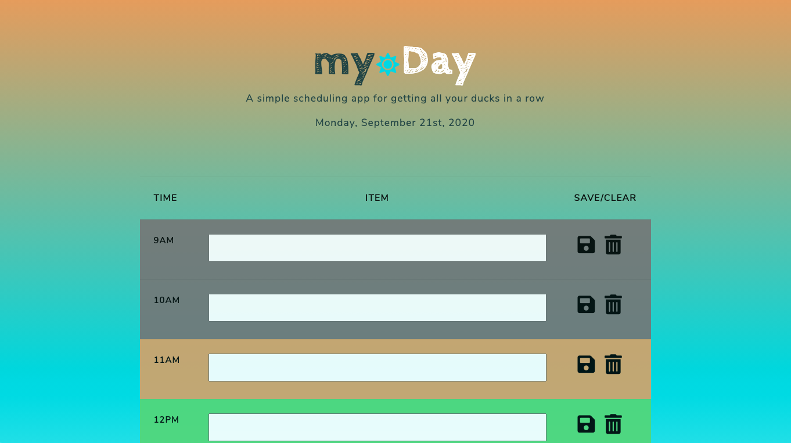
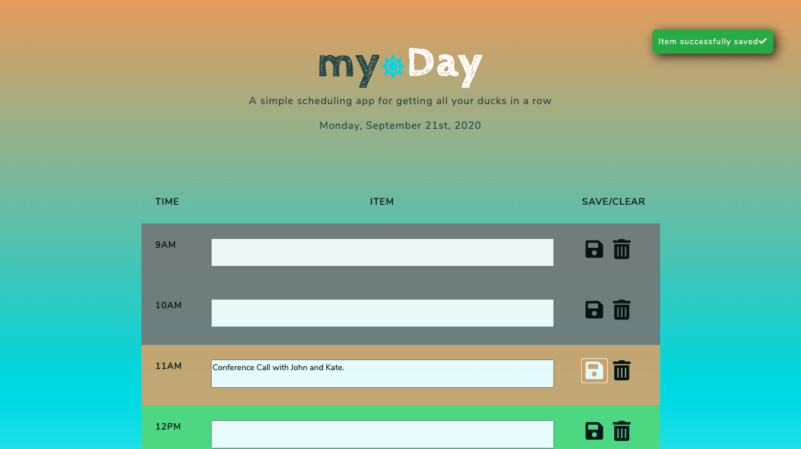
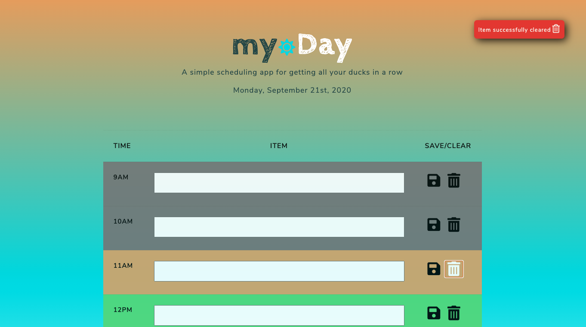

# myDay Scheduling Application

This is homework assignment #5 for the University of Richmond Full Stack Bootcamp.  The goal of this project was to create a simple daily planner application that makes it easy for the user to manage their time in an organized and intuitive fashion.  A couple highlights of the application:

    1. Features color coded time blocks based on the current hour. (Grey = Past, Orange = Present, Green = Future)
    2. Utilization of local storage to save items so the content persists on reload of the page.
    3. Ability to delete items when necessary.
    4. Toast notifications to let the user know that their items have been successfully saved or deleted.

## Technologies
   **HTML5**  
   **CSS3**  
   **JavaScript**  
   **Bootstrap**  
   **Moment.js**  
   **jQuery** 
   

## Screenshots

 

 

 

## Resources
   **Bootswatch**  
   **Google Fonts**  
   **Font Awesome** 

### License & Copyright

Copyright &copy; Tanner Kirkpatrick 2020

